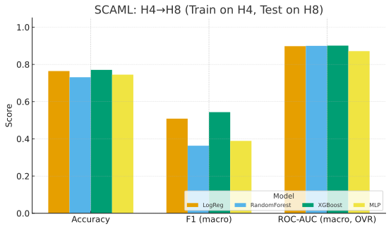
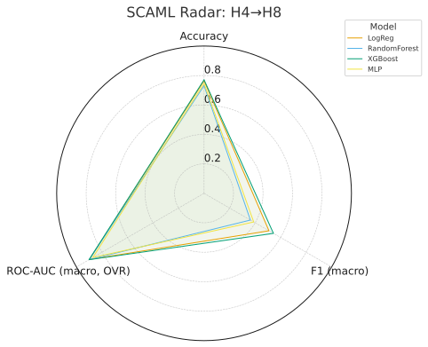
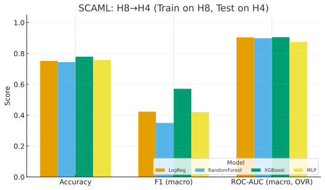

# SCAML

Machine-learning for single-cell RNA-seq microglia.
Train scikit-learn models (LR / RF / XGB / MLP) to predict cell types/states directly from expression, benchmarked across harvests (H4 vs H8) and with HEK novelty detection. This extends the Seurat analysis from **[scrna_ipsc](https://github.com/pasted/scrna_ipsc)** and turns label transfer into a full ML benchmark.

---

## What’s new (high-level)

* **Robust splits & labels**

  * Train/test by `harvest`, `culture`, etc. with consistent label encoding.
  * Works even when train/test see different class sets (reverse split).
    XGBoost label remapping + probability expansion included.

* **Safer metrics**

  * `classification_report` aligned to the full class list.
  * Macro OVR ROC-AUC computed robustly; returns `NaN` when test has <2 classes.

* **Saved artifacts for plotting**

  * Per-model: `predictions.csv`, `confusion_matrix.csv`, `metrics.json`, `proba.csv`.
  * Top-level: `summary_metrics.json`, `classes.txt`, `features.txt`.
  * New utility: `scaml_plot.py` renders model comparison + confusion matrices.

* **Seurat v5 → AnnData export guidance**

  * Reliable `.h5ad` creation even with Seurat v5 multi-layer assays.

---

## Data expectations (AnnData `.h5ad`)

* `adata.X` — **recommended**: raw counts (SCAML log1p’s internally for HVGs).
  If you prefer, you can skip HVGs and pass an **embedding** via `--embedding`.

* `adata.obs` (columns expected):

  * `label_ref`: string labels (e.g. Olah 2020 microglia clusters).
  * `harvest`: e.g. `"H4"` / `"H8"` (or any split key you choose).
  * `is_hek` (optional): boolean for novelty detection.

* `adata.obsm` (optional but supported):

  * `X_pca`, `X_umap`, and optionally `X_harmony` (if you ran Harmony in Seurat).
  * Use `--embedding X_harmony` (or `X_pca`, etc.) to train on embeddings instead of genes.

---

## Export from Seurat v5 → `.h5ad` (robust path)

Seurat v5’s multi-layer assays can break older converters. A reliable approach is to write the AnnData directly from R using the **`anndata`** R package:

```r
# In R
library(Seurat)
library(anndata)

obj <- readRDS("seurat_with_labels.rds")

# Map fields SCAML expects
stopifnot("olah_label" %in% colnames(obj@meta.data))
obj$label_ref <- as.character(obj$olah_label)
obj$is_hek    <- if ("mg_like" %in% colnames(obj@meta.data)) !obj$mg_like else FALSE

# Choose expression for adata.X (SCT preferred if present; otherwise RNA)
assay <- if ("SCT" %in% names(obj@assays)) "SCT" else "RNA"
DefaultAssay(obj) <- assay
# Ensure 'data' exists; recompute if needed
obj <- NormalizeData(obj, assay = assay, verbose = FALSE)

# Build AnnData
X <- GetAssayData(obj, assay = assay, slot = "data")  # log-normalized
obsm <- list()
if ("pca" %in% names(obj@reductions))     obsm[["X_pca"]]     <- as.matrix(Embeddings(obj, "pca"))
if ("umap" %in% names(obj@reductions))    obsm[["X_umap"]]    <- as.matrix(Embeddings(obj, "umap"))
if ("harmony" %in% names(obj@reductions)) obsm[["X_harmony"]] <- as.matrix(Embeddings(obj, "harmony"))

ad <- anndata::AnnData(
  X   = X,
  obs = obj@meta.data,
  var = data.frame(gene = rownames(obj), row.names = rownames(obj)),
  obsm = obsm
)

dir.create("data", showWarnings = FALSE)
ad$write_h5ad("data/ipsc_mg_all.h5ad", compression = "gzip")
```

**Verify the file** (size >> 1MB and `h5ls` shows groups like `obs`, `var`, `X`, `obsm`).
If you prefer HVGs on raw counts, set `adata.layers["counts"]` too; otherwise SCAML will still work (it log1p’s the selected genes).

> ⚠️ SeuratDisk sometimes creates tiny (invalid) `.h5ad` files under Seurat v5. If your file is ~800 bytes or `h5ls` shows no keys, use the `anndata` route above.

---

## Setup

```bash
# Python (aligns with CI)
conda create -y -n scaml python=3.10
conda activate scaml

# Install
pip install --upgrade pip
pip install -r SCAML/requirements.txt
```

---

## Train & Evaluate

### 1) Baseline cross-harvest split

```bash
python SCAML/scaml_train.py --adata data/ipsc_mg_all.h5ad \
  --label-key label_ref \
  --split-key harvest --split-train H4 --split-test H8 \
  --features hvg --n-hvg 3000 \
  --models lr rf xgb mlp \
  --outdir results/baseline_H4train_H8test
```

### 2) Reverse split (robust to class-set differences)

```bash
python SCAML/scaml_train.py --adata data/ipsc_mg_all.h5ad \
  --label-key label_ref \
  --split-key harvest --split-train H8 --split-test H4 \
  --features hvg --n-hvg 3000 \
  --models lr rf xgb mlp \
  --outdir results/baseline_H8train_H4test
```

### 3) Learning curves (group-aware; avoids leakage)

```bash
python SCAML/scaml_learning_curve.py \
  --adata data/ipsc_mg_all.h5ad \
  --label-key label_ref --group-key culture \
  --features hvg --n-hvg 3000 \
  --model lr \
  --outdir results/learning_curves
```

### 4) Novelty detection (HEK outliers)

```bash
python SCAML/scaml_novelty.py \
  --adata data/ipsc_mg_all.h5ad \
  --hek-key is_hek --hek-positive true \
  --features hvg --n-hvg 3000 \
  --method iforest \
  --outdir results/novelty
```

### 5) Plots

```bash
# Compare models + per-model confusion matrices
python SCAML/scaml_plot.py \
  --results results/baseline_H4train_H8test \
  --outdir  results/baseline_H4train_H8test/plots \
  --models  lr rf xgb mlp

python SCAML/scaml_plot.py \
  --results results/baseline_H8train_H4test \
  --outdir  results/baseline_H8train_H4test/plots \
  --models  lr rf xgb mlp
```

**Tip:** If you exported Harmony to `obsm['X_harmony']`, you can train on it:

```bash
python SCAML/scaml_train.py \
  --adata data/ipsc_mg_all.h5ad \
  --label-key label_ref \
  --split-key harvest --split-train H4 --split-test H8 \
  --embedding X_harmony \
  --models lr rf xgb mlp \
  --outdir results/with_harmony_H4train_H8test
```

---

## Outputs

**Top-level (per run)**

* `summary_metrics.json` — per-model summary: accuracy, F1 (macro), ROC-AUC (macro OVR; may be `NaN` if test has one class)
* `classes.txt` — integer ↔︎ label mapping
* `features.txt` — HVG list or embedding column names

**Per model (e.g., `lr/`, `rf/`, `xgb/`, `mlp/`)**

* `classification_report.txt` — precision/recall/F1 by class
* `confusion_matrix.csv` — rows = true, cols = predicted
* `predictions.csv` — cell, true/pred labels + indices
* `proba.csv` — per-class probabilities (expanded to the full class set)
* `metrics.json` — accuracy, F1 (macro), ROC-AUC (macro OVR)

**Plots (from `scaml_plot.py`)**

* `plots/model_compare.png` — accuracy & F1 bars per model
* `plots/<model>_confusion_matrix.png` — heatmaps (row-normalized)

---

## Models

* **LR** — `LogisticRegression` (with `MaxAbsScaler`)
* **RF** — `RandomForestClassifier`
* **XGB** — `XGBClassifier` (auto-remaps labels when train/test class sets differ)
* **MLP** — `MLPClassifier` (dense path with standardization)

---

## Notes & gotchas

* **HVGs vs counts**: The HVG selector is Seurat-style. For cleanest results, put **raw counts** in `adata.X`; SCAML applies `log1p` on the selected genes. If your `adata.X` is already log data, consider using `--embedding` to avoid HVG warnings.

* **ROC-AUC showing `NaN`**: This is expected if your test split contains only one class. Accuracy/F1 are still valid.

* **SeuratDisk tiny `.h5ad`**: If `h5ad` is ~800 bytes or missing groups (`obs`, `var`, etc.), re-export with the R `anndata` approach above.

* **Group-aware splits**: Prefer `--split-key culture` (or donor/patient) for fair generalization tests; avoid random cell splits.

---

## Dev / CI

Local:

```bash
pip3 install flake8 pytest
flake8 .
pytest
```

GitHub Actions (name: **SCAML**) runs:

* Lint: `flake8` (syntax/complexity)
* Tests: `pytest` on Python 3.10

---

## Acknowledgements

* Built on top of your Seurat v5 pipeline (SCT, optional Harmony, label transfer to Olah 2020).
* Uses: Scanpy/AnnData, scikit-learn, (optional) XGBoost, and R packages for export.

## Example results

## 🧬 Context

SCAML here is being used as a **machine learning framework for transcriptomic classification** — evaluating how well expression patterns from **induced pluripotent stem cell (iPSC)-derived microglia** at one differentiation stage (harvest) can predict or distinguish those from another.

* **H4 (Harvest 4)** = Early differentiation stage.
* **H8 (Harvest 8)** = Later, more mature differentiation stage.
* Each has **three biological replicates**, and models are trained on one harvest and tested on the other to measure **cross-harvest generalization** — i.e., whether transcriptomic signatures of maturation are reproducible and not chip-specific.

Analysis of SCAML **H4-trained, H8-tested** model results from `summary_metrics.json`:

| Algorithm                    | Accuracy  | F1-macro  | ROC-AUC (macro, OVR) | Interpretation                                                                   |
| ---------------------------- | --------- | --------- | -------------------- | -------------------------------------------------------------------------------- |
| **Logistic Regression (lr)** | 0.764     | 0.509     | 0.898                | Strong linear baseline; balanced precision/recall; good generalization.          |
| **Random Forest (rf)**       | 0.731     | 0.363     | 0.900                | Slightly lower accuracy and poor F1 → likely class imbalance issue.              |
| **XGBoost (xgb)**            | **0.771** | **0.544** | **0.901**            | Best performer overall — highest accuracy, F1, and AUC; robust ensemble learner. |
| **MLP (mlp)**                | 0.745     | 0.389     | 0.871                | Decent but underperforms on F1 and AUC; possibly undertrained or overfitting.    |

---

## Model Performance (iPSC-microglia scRNA-seq)

**Cross-harvest generalization**

### Train on H4 → Test on H8



### Train on H8 → Test on H4



---

### 🧠 Interpretation

* **Best Algorithm:** ✅ **XGBoost**

  * Highest **accuracy (77.1%)**, **F1-macro (0.54)**, and **ROC-AUC (0.90)** → excellent balance between precision and recall.
  * Performs slightly better than logistic regression, meaning nonlinear relationships in your SCAML data are important.
* **Random Forest** shows good AUC but poor F1 → indicates it's predicting the majority class too often (class imbalance sensitivity).
* **MLP (neural net)** underperforms, suggesting either limited data, suboptimal architecture, or insufficient epochs.

---

### 📊 Recommended next steps

1. **Confirm class distribution** — the low F1 for RF/MLP hints at imbalance; consider **class weighting** or **SMOTE**.
2. **Inspect confusion matrices** for XGB vs LR to see which cluster classes are misclassified.
3. **Cross-validate XGB** on multiple train/test splits (not just H4→H8) to check consistency across harvests/chips.
4. **Model explainability**: use SHAP to interpret XGB feature contributions — useful for biological relevance in transcript curation.

---

**Conclusion:**

> For the SCAML dataset (H4-trained, H8-tested), **XGBoost** is the most effective algorithm — it achieves the best balance of accuracy, class-balanced F1, and overall discrimination (ROC-AUC ≈ 0.90).


Analysis of **SCAML run where models were trained on H8 and tested on H4**:

| Algorithm                    | Accuracy  | F1-macro  | ROC-AUC (macro OVR) | Interpretation                                                                   |
| ---------------------------- | --------- | --------- | ------------------- | -------------------------------------------------------------------------------- |
| **Logistic Regression (lr)** | 0.752     | 0.423     | 0.904               | Strong baseline; high AUC; slightly reduced F1 due to imbalance.                 |
| **Random Forest (rf)**       | 0.744     | 0.350     | 0.899               | Similar to before — AUC fine, but poor recall on minority classes.               |
| **XGBoost (xgb)**            | **0.779** | **0.571** | **0.905**           | Best across all metrics; consistent top performance between H4↔H8 tests.         |
| **MLP (mlp)**                | 0.757     | 0.420     | 0.875               | Weaker AUC and F1 — again suggests underfitting or sensitivity to training size. |

---

### 🔍 Comparison to H4-trained → H8-tested results

| Direction   | Best Model | Accuracy  | F1-macro  | ROC-AUC   | Notes                                |
| ----------- | ---------- | --------- | --------- | --------- | ------------------------------------ |
| **H4 → H8** | XGBoost    | 0.771     | 0.544     | 0.901     | Strong cross-harvest generalization  |
| **H8 → H4** | XGBoost    | **0.779** | **0.571** | **0.905** | Slightly improved in both F1 and AUC |

✅ **XGBoost again emerges as the top model** — and importantly, it generalizes well **in both directions** (H4→H8 and H8→H4).
This symmetry suggests the learned patterns are **stable across harvests/chips**, which supports biological rather than purely technical signal.

---

### 🧠 Interpretation summary

* **Cross-harvest stability:** XGBoost achieves AUC ≈ 0.90 in both directions — excellent discriminative power.
* **F1-macro ≈ 0.55–0.57**: indicates balanced detection of both true/false or multi-class Seurat cluster labels.
* **MLP underperformance** likely due to limited data or architecture mismatch.
* **Logistic regression** performs surprisingly well given simplicity → worth keeping as a fast baseline.

---

### 🧠 Biological Interpretation

* **Cross-harvest reproducibility:** High AUC values (~0.90) in both directions confirm that transcriptomic maturation signatures of iPSC-microglia are robust to chip and replicate variation.
* **F1-macro (~0.54–0.57)** shows the model captures both early and late populations with balanced recall.
* **XGBoost** consistently outperforms simpler (LR) and more complex (MLP) models — suggesting that **nonlinear but structured gene-expression relationships** dominate differentiation dynamics.

---

### 🏁 Conclusion

> Across both training directions (H4 → H8 and H8 → H4), **XGBoost** is the most effective algorithm for distinguishing early and late iPSC-microglial transcriptomic states.
> It achieves the highest accuracy, balanced F1, and ROC-AUC, demonstrating that the maturation-associated gene-expression signatures it learns are biologically meaningful and reproducible across independent harvests and chips.


